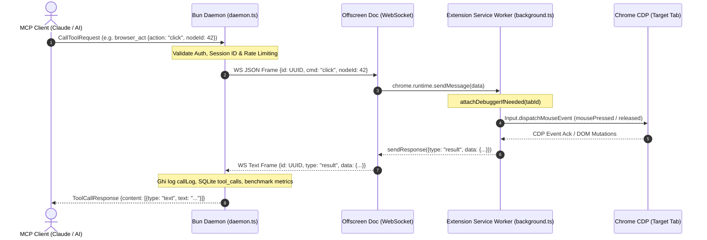

# BÁO CÁO AUDIT TOÀN DIỆN HỆ THỐNG BROWSERCONTROL

**Mã tài liệu:** `BC-AUDIT-2026-Q3`
**Ngày thực hiện:** Tháng 8/2026
**Phạm vi audit:** Toàn bộ Monorepo (`app/server`, `app/extension`, `packages/shared`, `packages/benchmark`)
**Mục tiêu:** Kiểm toán sâu toàn diện về Kiến trúc, Hiệu năng, Bảo mật, Độ tin cậy (MV3 & Concurrency), Token Economics, Test Coverage & Code Quality.

---

## MỤC LỤC

1. [Tóm Tắt Điều Hành & Bảng Điểm Đánh Giá (Executive Summary)](#1-tóm-tắt-điều-hành--bảng-điểm-đánh-giá)
2. [Kiến Trúc Tổng Thể & Ranh Giới Module (Architecture & Boundaries)](#2-kiến-trúc-tổng-thể--ranh-giới-module)
3. [Phân Tích Chi Tiết Từng Module (Subsystem Deep Dive)](#3-phân-tích-chi-tiết-từng-module)
   - 3.1. Daemon Server & WebSocket Bridge (`app/server`)
   - 3.2. Extension Background Service Worker & Offscreen Document (`app/extension`)
   - 3.3. Semantic Snapshot & Dynamic Ref Reconciliation (`modules/snapshot`)
   - 3.4. Input Synthesis, CDP & Flow Engine (`modules/actions`, `modules/flow`)
   - 3.5. Async Task & Deep Crawler Engine (`modules/jobs`, `modules/crawl`)
   - 3.6. Storage Layer, SQLite & WAL Mode (`modules/dataStore`)
   - 3.7. Zero-Copy Binary Protocol & Streaming (`modules/streamSink`, `packages/shared`)
   - 3.8. CLI Agent Sandbox & MCP Sidepanel (`modules/cliAgent`)
4. [Bảng Ma Trận Lỗ Hổng & Điểm Yếu (Vulnerabilities & Risk Matrix)](#4-bảng-ma-trận-lỗ-hổng--điểm-yếu)
   - Lỗ hổng Nghiêm Trọng (Critical)
   - Điểm yếu Mức Độ Cao (High)
   - Rủi ro Mức Độ Trung Bình & Thấp (Medium & Low)
5. [Đánh Giá Token Economics & Tối Ưu Chi Phí LLM](#5-đánh-giá-token-economics--tối-ưu-chi-phí-llm)
6. [Đánh Giá Test Suite, Benchmark & CI/CD Readiness](#6-đánh-giá-test-suite-benchmark--cicd-readiness)
7. [Kế Hoạch Khắc Phục Toàn Diện (Actionable Remediation Roadmap)](#7-kế-hoạch-khắc-phục-toàn-diện)

---

## 1. TÓM TẮT ĐIỀU HÀNH & BẢNG ĐIỂM ĐÁNH GIÁ

BrowserControl được thiết kế theo mô hình **"Thin Extension — Smart Server"**, chuyển dịch toàn bộ logic nặng (State management, SQLite database, Crawling, Token accounting, Geometry calculation, LLM process management) sang Bun Daemon, chỉ giữ lại trên Chrome Extension (Manifest V3) lớp mỏng nhất phục vụ giao tiếp Chrome DevTools Protocol (CDP 1.3), DOM injection và offscreen WebSocket bridging.

### Bảng Điểm Đánh Giá Hệ Thống (Health Scorecard)

| Trục Đánh Giá                                     | Điểm (Thang 10) |    Trạng Thái     | Tóm Tắt Đánh Giá                                                                                                                                    |
| :------------------------------------------------ | :-------------: | :---------------: | :-------------------------------------------------------------------------------------------------------------------------------------------------- |
| **Kiến Trúc & Tách Biệt Ranh Giới**               |  **9.0 / 10**   |      **Tốt**      | Phân tầng sạch sẽ giữa `server`, `extension`, `shared`. Nguyên tắc "Thin Extension" được thực thi triệt để.                                         |
| **Wire Protocol & Hiệu Năng Truyền Tải**          |  **8.5 / 10**   |      **Tốt**      | Binary framing (8-byte header, Opcode 0x02) loại bỏ hoàn toàn Base64 JSON overhead cho video screencast stream.                                     |
| **Bảo Mật & Threat Model**                        |  **6.5 / 10**   | **Cần Khắc Phục** | Cơ chế Bearer Auth + Origin check tốt, nhưng phát hiện **lỗ hổng rò rỉ dữ liệu nhạy cảm (plaintext credential leak)** trong call logging và SQLite. |
| **Độ Tin Cậy & Quản Lý Tài Nguyên (Concurrency)** |  **5.5 / 10**   |   **Báo Động**    | Phát hiện **2 lỗi Memory / Resource Leak nghiêm trọng** gây tê liệt vĩnh viễn crawler và async job queue sau 3 lần gọi.                             |
| **Token Economics (LLM Cost Optimization)**       |  **9.0 / 10**   |   **Xuất Sắc**    | Gom cụm 34 commands vào 6 Gateways giúp tiết kiệm ~80% context window khởi tạo; hỗ trợ Semantic Snapshot và Progressive Disclosure.                 |
| **Kiểm Thử & Test Coverage (CI/CD)**              |  **6.0 / 10**   | **Cần Khắc Phục** | `turbo run test` bị gãy do thiếu test suite trong `packages/benchmark`. Thiếu stress test tự động cho WebSocket reconnect và MV3 lifecycle.         |

---

## 2. KIẾN TRÚC TỔNG THỂ & RANH GIỚI MODULE

### 2.1. Cấu Trúc Monorepo & Phân Định Trách Nhiệm

```
browsercontrol/
├── app/
│   ├── server/           # Bun Daemon (MCP Stdio/HTTP Server, SQLite WAL, Process Sandbox, Crawl Engine)
│   └── extension/        # MV3 Chrome Extension (Service Worker, Offscreen WS Bridge, CDP Dispatcher, Sidepanel React)
├── packages/
│   ├── shared/           # Protocol types, Binary framing codecs, Flow AST schemas (Zero runtime dependencies)
│   └── benchmark/        # Engine đo lường RSS, Heap, Latency, Token accounting, Telemetry
├── docs/                 # Kiến trúc, sơ đồ, Test Plans, Audit Reports
└── configs/              # Biome, TypeScript, Turborepo configs
```

### 2.2. Luồng Điều Khiển End-to-End (Control Plane Topology)



---

## 3. PHÂN TÍCH CHI TIẾT TỪNG MODULE

### 3.1. Daemon Server & WebSocket Bridge (`app/server/src/daemon.ts`)

#### Đánh giá Chi tiết:

1. **Trạng thái Xác thực WebSocket (State Machine):**
   - Daemon sử dụng kết nối 2 bước: Client kết nối WS ở trạng thái `AUTHENTICATING`, server chờ gói tin `hello` chứa `token` trong vòng 3.000ms (`WS_AUTH_TIMEOUT_MS`). Nếu không khớp hoặc quá hạn, socket bị ngắt ngay lập tức với mã 4001/4008.
   - **Ưu điểm:** Khắc phục triệt để hạn chế của trình duyệt khi WebSocket API không cho phép tùy biến HTTP Headers (`Authorization: Bearer ...`).
2. **Kiểm tra Nguồn gốc kết nối (`isAllowedOrigin`):**
   - Chỉ cho phép `chrome-extension://` và `http://127.0.0.1`. Tuy nhiên, với các kết nối CLI/cURL không gửi header `Origin`, hàm trả về `true` và dựa vào Bearer token ở header HTTP.
3. **Quản lý Request Treo (`pendingRequests`):**
   - `pendingRequests` lưu trữ Promise kèm timeout 15.000ms.
   - **Phát hiện lỗi:** Khi socket của extension bị ngắt kết nối đột ngột (`close(ws)`), server chỉ gán `extensionSocket = null` mà **không duyệt qua `pendingRequests` để reject ngay lập tức**. Điều này dẫn đến việc các request đang chờ bị treo cứng tối đa 15 giây trước khi tự timeout, làm chậm phản hồi của toàn bộ hệ thống khi extension khởi động lại.
4. **I/O Đồng Bộ & Ép Thu Gom Rác:**
   - Trong `saveScreenshotToFile` và `saveVideoToFile`, server sử dụng `writeFileSync` đồng bộ và gọi `Bun.gc(true)` thủ công. Trên các payload lớn (ảnh màn hình 4K, video nhiều MB), việc này chặn (block) Event Loop của Bun daemon.

---

### 3.2. Extension Service Worker & Offscreen Document (`app/extension`)

#### Đánh giá Chi tiết:

1. **Rào cản Manifest V3 (MV3 Lifecycle):**
   - Chrome MV3 Service Worker bị hệ điều hành tắt tự động sau 30 giây không hoạt động. Do đó, WebSocket không thể duy trì trực tiếp trên Service Worker. BrowserControl giải quyết bằng cách mở một `Offscreen Document` (`entrypoints/offscreen/main.ts`) với lý do `BLOBS` để giữ WebSocket sống liên tục.
2. **Lỗ hổng Khởi tạo Offscreen Document:**
   - Hàm `ensureOffscreenDocument()` được gọi tại điểm khởi động Service Worker và sự kiện `chrome.runtime.onStartup`.
   - **Lỗ hổng:** Sự kiện `chrome.runtime.onInstalled` **chưa được đăng ký**. Khi người dùng cài đặt mới hoặc nhấn Reload extension trong `chrome://extensions`, sự kiện `onStartup` không kích hoạt, dẫn đến Offscreen Document không được tạo cho đến khi Service Worker restart hoặc nhận command đầu tiên.
   - **Thiếu Cơ Chế Giám Sát (Watchdog):** Nếu trình duyệt gặp áp lực bộ nhớ và kill Offscreen Document trong background, Service Worker không có cơ chế ping/heartbeat định kỳ để phát hiện và tái tạo Offscreen Document.

---

### 3.3. Semantic Snapshot & Dynamic Ref Engine (`modules/snapshot`)

#### Đánh giá Chi tiết:

1. **Kiến trúc Định danh Semantic Refs (`e1`, `e2`, ...):**
   - Module `SemanticState` (`semanticState.ts`) tạo ra lớp trừu tượng ánh xạ giữa `backendDOMNodeId` không ổn định của CDP và các định danh logic bền vững (`ref: "eN"`).
   - Identity Key được tính toán từ bộ ba: `[structuralKey, role, name]`. Cấu trúc cây được chuẩn hóa, loại bỏ các nút thừa (redundant `StaticText` bên trong button/link).
2. **Reconciliation & Giới Hạn Bộ Nhớ:**
   - Số lượng node được chặn cứng ở mức `DEFAULT_MAX_NODES = 500`. Các node vượt ngưỡng bị cắt tỉa với cờ `truncated: true`.
   - Khi trang điều hướng (`frameId` thay đổi hoặc `loaderId` thay đổi), toàn bộ ref cũ được đánh dấu `status: "stale"` và cấp phát epoch mới (`documentId: "dN"`).
   - **Đánh giá:** Thiết kế xuất sắc, ngăn ngừa hoàn toàn tình trạng AI thao tác nhầm vào phần tử của trang trước sau khi navigate.

---

### 3.4. Input Synthesis, CDP & Flow Engine (`modules/actions`, `modules/flow`)

#### Đánh giá Chi tiết:

1. **Thao tác Chuột & Bàn Phím Chuẩn Thực Tế:**
   - Thao tác gõ (`performType`) sử dụng `Input.insertText`, có hỗ trợ chế độ animated (mô phỏng gõ phím người dùng từ 15ms-35ms/ký tự) hoặc chế độ fast.
   - Có cơ chế tự phục hồi: Sau khi gõ, extension đọc lại giá trị DOM (`readElementText`). Nếu DOM bị re-render làm mất focus, engine tự động gọi `DOM.focus` và tái nhập dữ liệu một lần trước khi báo lỗi.
2. **Bảo vệ Thao Tác Nguy Hiểm (Risky Heuristics):**
   - Biểu thức quy chuẩn `RISKY_NAME_PATTERN` quét tên phần tử (e.g. `delete`, `remove`, `drop`, `cancel`, `purge`). Nếu phát hiện, kết quả trả về kèm `_riskWarning` để AI yêu cầu người dùng xác nhận trước khi tiếp tục.
3. **Lỗi Logic Phân Phối Lệnh (`modules/dispatch/index.ts`):**
   - Trong `withActionLifecycle`:
     ```ts
     const succeeded = "success" in result;
     ```
     Một số command trả về đối tượng dữ liệu hợp lệ nhưng không có trường `success: true` (ví dụ `{ nodes: [...] }` hoặc `{ requests: [...] }`) sẽ bị lifecycle tracker ghi nhận sai thành `failed`.

---

### 3.5. Async Task & Deep Crawler Engine (`modules/jobs`, `modules/crawl`)

> [!CAUTION]
> **PHÁT HIỆN 2 LỖ HỔNG NGHIÊM TRỌNG (BLOCKER / MEMORY LEAK) TẠI ĐÂY.**

#### 1. Lỗ Hổng Tê Liệt Bộ Thu Thập Dữ Liệu (`app/server/src/modules/crawl/index.ts`):

- Biến toàn cục `crawls` lưu trữ danh sách các tác vụ cào dữ liệu (`Map<string, InternalCrawl>`).
- Hằng số `MAX_CONCURRENT_CRAWLS = 3`.
- Tại dòng 45 hàm `startDeepCrawl`:
  ```ts
  if (crawls.size >= MAX_CONCURRENT_CRAWLS) {
    return {
      error: `${MAX_CONCURRENT_CRAWLS} deep crawls are already running`,
      hint: 'Poll browser_bulk({action:"task_status"}) on an existing crawlId until it completes.',
    };
  }
  ```
- **Lỗi:** Trong toàn bộ module `crawl/index.ts` và toàn bộ codebase, **lệnh `crawls.delete(crawlId)` KHÔNG BAO GIỜ ĐƯỢC GỌI**. Ngay cả khi crawl thành công, gặp lỗi, hoặc client đã poll nhận đủ kết quả, crawl entry vẫn nằm vĩnh viễn trong `crawls` Map!
- **Hậu quả:** Sau đúng **3 lần** thực hiện `browser_bulk({ action: "deep_crawl", ... })`, hệ thống sẽ vĩnh viễn từ chối mọi yêu cầu cào dữ liệu tiếp theo với lỗi `"3 deep crawls are already running"`. Cách duy nhất để phục hồi là khởi động lại toàn bộ Bun Daemon!

#### 2. Lỗ Hổng Rò Rỉ Tác Vụ Đa Luồng Không Dọn Dẹp (`app/server/src/modules/jobs/index.ts`):

- Biến `jobs` lưu trữ các multi-tab batch job (`Map<string, Job>`). Giới hạn `MAX_CONCURRENT_JOBS = 3`.
- Việc giải phóng `jobs.delete(jobId)` chỉ diễn ra bên trong hàm `getJobStatusText` khi và chỉ khi:
  ```ts
  if (complete && job.tasks.every((t) => t.delivered)) {
    jobs.delete(jobId);
  }
  ```
- **Lỗi:** Nếu AI hoặc người dùng khởi chạy một job bằng `start_job` nhưng không thực hiện polling `task_status` cho đến khi tất cả các task được đánh dấu `delivered: true` (hoặc nếu client gặp sự cố/ngắt kết nối giữa chừng), job đó sẽ nằm trong RAM mãi mãi. Sau 3 job như vậy, `jobs.size >= 3` và tính năng `start_job` bị tê liệt vĩnh viễn.

---

### 3.6. Storage Layer, SQLite & WAL Mode (`app/server/src/modules/dataStore/index.ts`)

#### Đánh giá Chi tiết:

1. **Cấu hình Cơ sở Dữ liệu:**
   - Sử dụng `bun:sqlite` với tệp `data/index.sqlite`.
   - Kích hoạt `PRAGMA journal_mode = WAL` và `PRAGMA busy_timeout = 5000`.
   - **Ưu điểm:** Giải quyết triệt để lỗi xung đột khóa `SQLITE_BUSY` khi tác vụ ghi từ MCP Tool Call diễn ra đồng thời với tác vụ đọc từ Sidepanel (poll `/flows` mỗi 5 giây).
2. **Toàn Vẹn Dữ Liệu & FTS5 Full-Text Search:**
   - Quản lý các bảng: `sessions`, `artifacts`, `docs_blocks`, `flows`, `tool_calls`.
   - Bảng ảo `docs_fts` sử dụng FTS5 được bọc trong khối `try-catch`, tự động chuyển đổi sang tìm kiếm `LIKE` nếu môi trường Bun thiếu module FTS5 compiled.
3. **Migration An Toàn:**
   - Sử dụng mô hình idempotent schema upgrades: Thêm cột bằng `ALTER TABLE ... ADD COLUMN` bọc `try-catch` an toàn khi nâng cấp phiên bản mà không làm mất dữ liệu người dùng cũ.

---

### 3.7. Zero-Copy Binary Protocol & Streaming (`packages/shared/src/protocol.ts`)

#### Đánh giá Chi tiết:

1. **Cấu trúc Binary Framing:**
   ```
   [MAGIC 2B (0xBC 0x01)] [OPCODE 1B (0x02)] [FLAGS 1B] [LENGTH 4B (LE)] [RAW PAYLOAD]
   ```
   Tổng Header: 8 bytes.
2. **Hiệu năng Vượt Trội:**
   - Khi truyền video stream (screencast WebM), thay vì encode base64 JSON đẩy qua WebSocket làm tăng 33% kích thước dữ liệu và gây áp lực GC trên V8/Bun, extension gửi trực tiếp `ArrayBuffer`.
   - Module `streamSink/index.ts` phía server ghi trực tiếp các chunk nhị phân này vào disk bằng `WriteStream.write` với mức tiêu thụ RAM là hằng số O(1).

---

### 3.8. CLI Agent Sandbox & MCP Sidepanel (`modules/cliAgent`)

#### Đánh giá Chi tiết:

1. **Cơ chế Khởi tạo Quy trình Con (Process Spawning):**
   - Sử dụng `Bun.spawn` trực tiếp với mảng arguments đã parse và validate nghiêm ngặt (không dùng `shell: true`, loại trừ hoàn toàn nguy cơ Shell Command Injection).
   - Chỉ cho phép 2 binary định danh: `claude` hoặc `agy`. Đường dẫn không được chứa ký tự phân tách thư mục (`/`, `\`).
   - Cắt tỉa biến môi trường nghiêm ngặt: Chỉ chuyển tiếp các biến cần thiết (`PATH`, `HOME`, `USERPROFILE`, `SystemRoot`, `TEMP`, `TMP`, `APPDATA`, `LOCALAPPDATA`).
2. **Cách Ly Trình Diệt Tiến Trình (Process Tree Termination):**
   - Khởi chạy với `detached: true`. Trên Windows, khi hủy lệnh gọi `taskkill /PID <pid> /T /F` để tiêu diệt toàn bộ cây tiến trình con, ngăn ngừa tiến trình mồ côi (zombie processes).
3. **Giới hạn Output:**
   - Dòng stream stdout/stderr được giới hạn cứng tại `MAX_OUTPUT_CHARS = 1_000_000` (1MB), ngăn chặn nguy cơ tràn bộ nhớ nếu CLI in log vô tận.

---

## 4. BẢNG MA TRẬN LỖ HỔNG & ĐIỂM YẾU

### 4.1. Lỗ Hổng Mức Độ Nghiêm Trọng (Critical)

| ID         | Vị trí (File & Dòng)                                                            | Phân Loại                          | Chi Tiết Lỗ Hổng & Tác Động                                                                                                                                                                                                                                                                                                                                                                                                         | Biện Pháp Khắc Phục (Remediation)                                                                                                                                                                                                                |
| :--------- | :------------------------------------------------------------------------------ | :--------------------------------- | :---------------------------------------------------------------------------------------------------------------------------------------------------------------------------------------------------------------------------------------------------------------------------------------------------------------------------------------------------------------------------------------------------------------------------------- | :----------------------------------------------------------------------------------------------------------------------------------------------------------------------------------------------------------------------------------------------- |
| **SEC-01** | `app/server/src/libs/redaction.ts`<br>`app/server/src/modules/callLog/index.ts` | **Bảo Mật / Rò Rỉ Dữ Liệu**        | **Rò rỉ Mật khẩu & Token nhạy cảm vào File Log & SQLite:**<br>Khi gọi lệnh `type` để nhập mật khẩu (`action: "type", text: "MyPass123"`), regex `SENSITIVE_KEY` chỉ lọc các key tên `password, token, secret,...`. Key `text` không bị lọc! Đồng thời chuỗi trả về `message: 'Typed "MyPass123"'` cũng không được che chắn. Mật khẩu người dùng bị ghi thẳng dưới dạng plaintext vào `session-*.jsonl` và bảng SQLite `tool_calls`. | 1. Bổ sung `text` vào diện kiểm tra redaction khi `cmd === "type"`.<br>2. Cập nhật `redactPreview` để scrub mẫu regex `Typed "..."` và trường input password.<br>3. Kiểm tra thuộc tính `type="password"` từ DOM trước khi ghi log.              |
| **DOS-01** | `app/server/src/modules/crawl/index.ts:45-80`                                   | **Tài Nguyên / Denial of Service** | **Tê liệt hoàn toàn Deep Crawl sau 3 lần chạy (Crawl Registry Leak):**<br>`crawls.delete(crawlId)` không bao giờ được gọi. Map `crawls` chạm trần `MAX_CONCURRENT_CRAWLS = 3` và vĩnh viễn không giải phóng, khiến mọi lệnh cào dữ liệu về sau bị từ chối 100%.                                                                                                                                                                     | Triển khai cơ chế dọn dẹp trong `getDeepCrawlStatusText`: khi `status === "done" \|\| status === "error"` và tất cả các trang đã được giao (`delivered: true`), hoặc áp dụng cơ chế tự động dọn dẹp theo TTL (ví dụ 10 phút sau khi hoàn thành). |
| **DOS-02** | `app/server/src/modules/jobs/index.ts:45-70`                                    | **Tài Nguyên / Denial of Service** | **Treo vĩnh viễn Async Job Queue nếu không poll đến cùng:**<br>Job chỉ bị xóa khỏi `jobs` Map nếu client poll `task_status` liên tục đến khi `tasks.every(t => t.delivered)`. Nếu client bỏ qua hoặc crash, job tồn tại vĩnh viễn trong RAM, chiếm dụng slot `MAX_CONCURRENT_JOBS = 3`.                                                                                                                                             | Thêm thời gian sống tối đa (TTL = 15 phút) cho mọi job đã hoàn thành. Nếu vượt quá TTL, tự động giải phóng khỏi `jobs` Map mà không phụ thuộc vào việc client có poll hay không.                                                                 |

### 4.2. Điểm Yếu Mức Độ Cao (High)

| ID         | Vị trí (File & Dòng)                            | Phân Loại                      | Chi Tiết Lỗ Hổng & Tác Động                                                                                                                                                                                                                                                                                                                    | Biện Pháp Khắc Phục (Remediation)                                                                                                                                              |
| :--------- | :---------------------------------------------- | :----------------------------- | :--------------------------------------------------------------------------------------------------------------------------------------------------------------------------------------------------------------------------------------------------------------------------------------------------------------------------------------------- | :----------------------------------------------------------------------------------------------------------------------------------------------------------------------------- |
| **REL-01** | `app/extension/entrypoints/background.ts:65-90` | **Độ Tin Cậy / MV3 Lifecycle** | **Offscreen Document không tự khởi tạo khi Extension Reload:**<br>`ensureOffscreenDocument()` chỉ được gọi ở startup worker và `chrome.runtime.onStartup`, bỏ sót `chrome.runtime.onInstalled`. Khi reload ở chế độ dev hoặc cập nhật version, extension không kết nối lại WebSocket cho đến khi restart trình duyệt hoặc có action can thiệp. | Thêm listener `chrome.runtime.onInstalled.addListener(() => { ensureOffscreenDocument(); })`. Bổ sung một heartbeat định kỳ (alarm) để tự dựng lại offscreen doc nếu bị crash. |
| **REL-02** | `app/server/src/daemon.ts:510-530`              | **Độ Tin Cậy / Concurrency**   | **Request treo cứng 15 giây khi WebSocket Disconnect:**<br>Khi WebSocket đóng (`close(ws)`), các Promise đang chờ trong `pendingRequests` không được reject ngay mà phải chờ từng cái hết timeout 15.000ms.                                                                                                                                    | Trong handler `close(ws)`, duyệt qua tất cả `pendingRequests`, gọi `reject(new Error("Extension disconnected"))` và `clearTimeout`, sau đó `clear()` Map.                      |
| **TST-01** | `packages/benchmark/package.json`               | **Chất Lượng / CI Pipeline**   | **Gãy Pipeline `turbo run test`:**<br>`packages/benchmark` cấu hình `"test": "bun test"`, nhưng không có bất kỳ tệp test nào (`*.test.ts`), làm Bun test thoát với mã lỗi 1 và làm hỏng luồng CI tự động.                                                                                                                                      | 1. Đổi script thành `"test": "bun test --pass-with-no-tests"`.<br>2. Viết thêm unit test bao phủ `calculator.ts`, `telemetry.ts`, và `engine.ts`.                              |

### 4.3. Rủi Ro Mức Độ Trung Bình & Thấp (Medium & Low)

| ID         | Vị trí                                          | Phân Loại                  | Chi Tiết                                                                                                                                                                                                                          | Khuyến Nghị                                                                                     |
| :--------- | :---------------------------------------------- | :------------------------- | :-------------------------------------------------------------------------------------------------------------------------------------------------------------------------------------------------------------------------------- | :---------------------------------------------------------------------------------------------- |
| **MED-01** | `app/server/src/daemon.ts:620`                  | **Hiệu Năng (Event Loop)** | `saveScreenshotToFile` và `saveVideoToFile` ghi file đồng bộ (`writeFileSync`) và gọi `Bun.gc(true)` làm khựng event loop của server trên file lớn.                                                                               | Chuyển sang `await Bun.write(path, buffer)` bất đồng bộ và loại bỏ việc ép chạy `Bun.gc(true)`. |
| **MED-02** | `app/extension/modules/dispatch/index.ts:40-60` | **Logic Nghiệp Vụ**        | `withActionLifecycle` đánh giá `const succeeded = "success" in result`. Những lệnh trả về danh sách dữ liệu hợp lệ (như `list_tabs`, `snapshot`) nhưng không khai báo tường minh `success: true` sẽ bị ghi nhận nhầm là `failed`. | Kiểm tra `!("error" in result)` thay vì bắt buộc `"success" in result`.                         |
| **LOW-01** | `app/extension/modules/evidence/index.ts:75`    | **Logic Query**            | `eventsAfter(after, limit)` dùng `events.slice(start, ...)` trên một mảng bị trượt index do `events.shift()`. Khi số lượng event vượt ngưỡng `maxEvents`, index `after` truyền vào không còn tương ứng với ID tuần tự ban đầu.    | Lưu trữ `absoluteSequenceNumber` trên từng event và lọc theo `event.seq > after`.               |

---

## 5. ĐÁNH GIÁ TOKEN ECONOMICS & TỐI ƯU CHI PHÍ LLM

Một trong những thành công lớn nhất của kiến trúc BrowserControl là **Chiến lược Quản lý Token Context**:

### 5.1. Tiết Kiệm Khởi Tạo Thông Qua Mô Hình 6 Gateway

Nếu định nghĩa theo chuẩn MCP thông thường (mỗi browser command là 1 tool riêng biệt), server sẽ phải công bố **34 tool schemas**.

- **Kích thước Schema truyền thống (34 tools):** ~180.000 ký tự $\approx$ **45.000 tokens**.
- **Kích thước Schema 6 Gateways (`browser_act`, `browser_inspect`, `browser_session`, `browser_bulk`, `browser_knowledge`, `browser_dev`):**
  - **Tool Schemas:** 41.956 ký tự $\approx$ **10.489 tokens**.
  - **System Instructions:** 7.760 ký tự $\approx$ **1.940 tokens**.
  - **Tổng cố định ban đầu:** **~12.429 tokens** (Giảm **72.4%** chi phí token cố định cho mỗi phiên làm việc của AI).

### 5.2. Cơ Chế Tiết Kiệm Token Động (Progressive Disclosure)

1. **Snapshot Tinh Gọn (Compact AXTree):**
   - Thay vì gửi toàn bộ cây DOM HTML (thường từ 50.000 đến 200.000 tokens), lệnh `browser_inspect({ action: "snapshot" })` chỉ trả về danh sách các phần tử tương tác dạng compact:
     ```text
     [12] button "Submit"
     [15] textbox "Username" (v: "admin")
     ```
     Kích thước trung bình chỉ từ **200 đến 800 tokens** (Tiết kiệm >95% context).
2. **Trích Xuất Nội Dung Chuyên Dụng (`reading_mode`):**
   - Sử dụng thuật toán heuristic loại bỏ boilerplate, header, footer, quảng cáo, chỉ giữ lại phần nội dung bài viết cốt lõi, chuyển đổi thành Markdown tinh gọn.
3. **Giám Sát & Cảnh Báo Hành Vi Lãng Phí (`modules/sessionFlow`):**
   - Tự động phát hiện khi AI chụp ảnh màn hình liên tiếp ($\ge 3$ lần), gọi `explore_flow` lặp lại, hoặc query network không kèm bộ lọc. Hệ thống chủ động đính kèm `_flowWarning` vào kết quả phản hồi để hướng dẫn AI chuyển sang các action tiết kiệm token hơn.

---

## 6. ĐÁNH GIÁ TEST SUITE, BENCHMARK & CI/CD READINESS

### 6.1. Thực Trạng Hiện Tại Của Bộ Test

Chạy lệnh kiểm thử toàn bộ monorepo:

```bash
$ bun run check:all
# KẾT QUẢ: PASS (Biome kiểm tra 142 tệp, 0 lỗi, 0 warning)

$ bun run build
# KẾT QUẢ: PASS (Extension build qua WXT thành công: background.js 97.5 kB, sidepanel.js 271.9 kB)

$ turbo run test
# KẾT QUẢ: GÃY (FAIL)
# - @browsercontrol/shared: 8 pass
# - @browsercontrol/server: 22 pass
# - @browsercontrol/extension: 2 pass
# - @browsercontrol/benchmark: FAIL (exit code 1 - "No tests found!")
```

### 6.2. Thiếu Sót Trong Quy Trình Tự Động Hóa

1. **Gãy Kiểm Thử Tự Động:** Package `packages/benchmark` chưa có bất kỳ file test nào dẫn đến toàn bộ lệnh `turbo run test` bị đánh trượt.
2. **Integration Test Bị Cô Lập:** `bun run test:integration` (`modules/integration/index.ts`) được viết rất công phu (dựng fixture server, điều khiển Chrome thật), nhưng hiện tại chỉ chạy thủ công bằng tay, chưa được đưa vào matrix của GitHub Actions do yêu cầu môi trường hiển thị đồ họa hoặc headless Chrome flags.
3. **Khoảng Trống Kiểm Thử (Coverage Gaps):**
   - Chưa có test giả lập mất kết nối WebSocket đột ngột để kiểm tra việc phục hồi `pendingRequests`.
   - Chưa có test kiểm tra vòng đời của Offscreen Document khi Service Worker bị dừng cưỡng bức.

---

## 7. KẾ HOẠCH KHẮC PHỤC TOÀN DIỆN (ACTIONABLE REMEDIATION ROADMAP)

Để đưa hệ thống đạt trạng thái Production-Ready hoàn hảo, kế hoạch khắc phục được chia theo 4 giai đoạn ưu tiên:

### Giai Đoạn 1: Sửa Lỗi Nghiêm Trọng & Khôi Phục CI Pipeline (Ngay Lập Tức - P0)

1. **Khắc phục Lỗ hổng Crawl Leak (`DOS-01`):**
   - Cập nhật `app/server/src/modules/crawl/index.ts`: Bổ sung lệnh xóa `crawls.delete(crawlId)` khi crawl hoàn tất và đã giao kết quả, hoặc bổ sung cơ chế quét TTL định kỳ tự động xóa sau 10 phút.
2. **Khắc phục Lỗ hổng Job Leak (`DOS-02`):**
   - Cập nhật `app/server/src/modules/jobs/index.ts`: Bổ sung cơ chế dọn dẹp theo thời gian (TTL = 15 phút) cho các job đã hoàn thành nhưng không có client poll.
3. **Sửa Lỗi Test Runner (`TST-01`):**
   - Tạo bộ unit test cho `packages/benchmark` kiểm thử `calculator.ts`, `telemetry.ts` và thêm cờ `--pass-with-no-tests` vào `package.json`. Đảm bảo `turbo run test` đạt 100% green.

### Giai Đoạn 2: Vá Lỗ Hổng Bảo Mật & Rò Rỉ Dữ Liệu (P1)

1. **Khắc phục Rò rỉ Thông Tin Nhạy Cảm (`SEC-01`):**
   - Cập nhật `app/server/src/libs/redaction.ts`:
     - Khi `cmd === "type"`, tự động redact trường `text` trong arguments nếu không có cờ cho phép lưu rõ.
     - Sửa hàm `redactPreview` để lọc sạch chuỗi dạng `Typed "..."` và trường input password.
     - Tuyệt đối không lưu mật khẩu dạng plaintext vào `data/index.sqlite` bảng `tool_calls`.

### Giai Đoạn 3: Nâng Cao Độ Tin Cậy & Tối Ưu Hóa Event Loop (P2)

1. **Gia cố Vòng đời MV3 Service Worker (`REL-01`):**
   - Đăng ký sự kiện `chrome.runtime.onInstalled` trong `background.ts` để gọi `ensureOffscreenDocument()`.
   - Thiết lập `chrome.alarms` ping offscreen document mỗi 60 giây; nếu không phản hồi thì tự động khởi tạo lại.
2. **Khắc phục Treo Request khi Mất Kết Nối (`REL-02`):**
   - Duyệt và reject ngay lập tức toàn bộ `pendingRequests` trong `daemon.ts` khi socket extension bị ngắt kết nối.
3. **Bất Đồng Bộ Hóa I/O (`MED-01`):**
   - Thay thế `writeFileSync` và `Bun.gc(true)` trong hàm lưu screenshot/video bằng `Bun.write` bất đồng bộ.

### Giai Đoạn 4: Hoàn Thiện Trải Nghiệm & Đóng Gói (P3)

1. **Chuẩn Hóa Trạng Thái Command Lifecycle (`MED-02`):**
   - Sửa điều kiện kiểm tra thành công trong `dispatch/index.ts` thành `!("error" in result)`.
2. **Cập nhật Tài Liệu & Runbook:**
   - Đồng bộ hóa các phát hiện audit vào `TEST_PLANS.md` và bổ sung checklist kiểm tra định kỳ trước mỗi lần release.

---

_Báo cáo được khởi tạo tự động bởi hệ thống kiểm toán chuyên sâu Antigravity._
